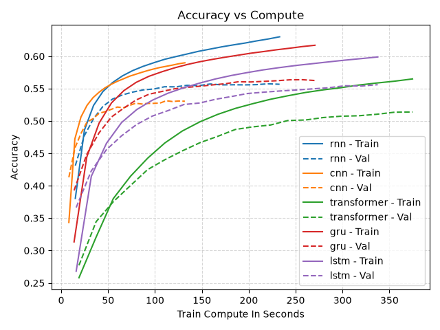
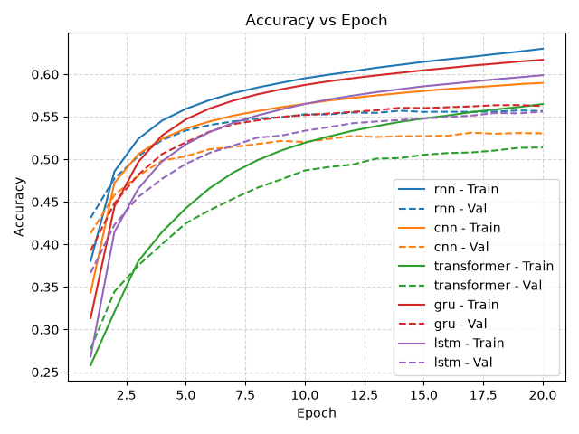

# Shakespeare Sequence Models

Test the RNN model here:

https://shonczinner.github.io/shakespeare-generator/

Compare RNN, GRU, LSTM, CNN, Transformer models for generating shakespeare one character at a time by training on the Shakespeare dataset.

| model       |   parameters |   best_val_loss |   best_val_accuracy |   total_compute |
|:------------|-------------:|----------------:|--------------------:|----------------:|
| rnn         |       969537 |         1.48838 |            0.557416 |         232.882 |
| cnn         |       689217 |         1.60532 |            0.531277 |         131.854 |
| transformer |      1219137 |         1.6394  |            0.513888 |         374.643 |
| gru         |       822849 |         1.4665  |            0.563739 |         270.567 |
| lstm        |      1086017 |         1.49977 |            0.556056 |         337.578 |

Generation sample from RNN with prompt "ROMEO:",

    ROMEO:
    I am love's peace than his pensiat,
    Who spired to defend my liege; this way thomar, O sir;
    Here could have I to die to deny me or,
    And with a string to the rock. You have secure them?

    QUEEN YORK:
    My old succession! none to his rateful his love,
    Lie haunt me with me on hang on that thirk?

    ISABELLA

Requirements:

torch
numpy
matplotlib
pandas
onnxscript